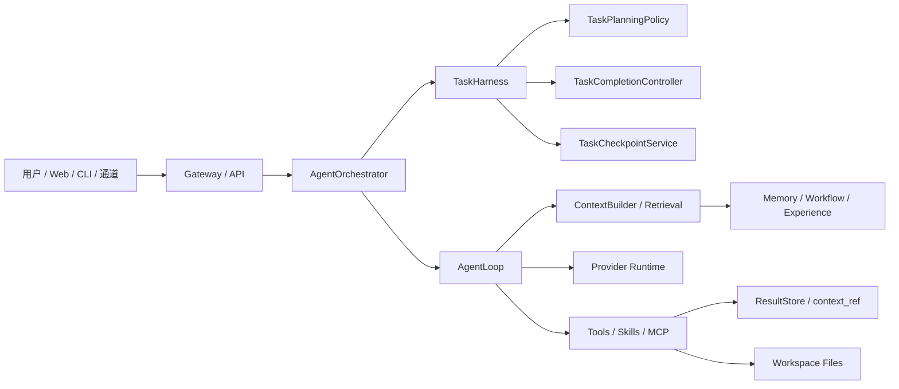

# JobClaw

JobClaw 是一个本地优先的智能体运行时与工作台，用于把大模型从“聊天回复”扩展为“可执行、可观察、可恢复、可沉淀经验”的任务执行系统。

它面向真实工作流：读取文件、分析资料、批量审查、生成报告、调用命令、使用工具、拆分子任务、跨通道交互，并通过任务运行时判断任务是否真正完成。

## 核心特性

- 本地优先：配置、会话、记忆、经验、子智能体、检查点默认存放在本机 workspace。
- 任务运行时：通过 TaskHarness 管理计划、执行、观察、验证、修复、完成。
- 完成控制器：用任务状态、子任务、工具、产物和最终回复共同判断 `COMPLETE / CONTINUE / REPAIR / BLOCKED`。
- 子智能体：支持继承主智能体配置，也支持按角色或自定义智能体覆盖模型、工具和技能。
- 批量任务：通过 worklist 与 subtasks 管理多个独立子项，避免父任务误判完成。
- 长任务支持：提供 checkpoint、context ref、结果摘要和经验参考，降低上下文膨胀风险。
- 经验系统：区分 Memory、Workflow Memory、Learning Candidates、Experience Memory 和 Skills。
- 工具体系：文件、命令、网络、记忆、MCP、Cron、多智能体、协作黑板等能力统一接入。
- Web Console：聊天、会话、智能体配置、任务事件流、学习候选、经验和运行配置可视化。
- 多通道接入：Web、CLI、Feishu、Telegram、Discord、DingTalk、QQ 等通道通过 Gateway 进入主执行链路。
- Jar 分发：前端静态资源会打入 Spring Boot jar，离线环境无需单独部署前端。

## 运行架构



## 任务运行时

JobClaw 的主链路不依赖模型一句“我完成了”来结束任务。每次任务都会创建一个 harness run，并在运行中持续积累证据。

### TaskHarness 阶段

- `PLAN`：识别任务模式，生成完成定义。
- `ACT`：调用模型、工具和子智能体推进任务。
- `OBSERVE`：记录工具、子任务、文件和执行事件。
- `VERIFY`：检查任务状态是否满足完成条件。
- `REPAIR`：缺少必要结构、产物或结果时进行定向修复。
- `FINISH`：任务满足完成定义。
- `FAILED`：出现不可恢复错误或修复预算耗尽。

### 规划模式

- `DIRECT`：简单问答、解释、单步查询。
- `PHASED`：多步骤但强耦合任务，例如分析数据并生成报告。
- `WORKLIST`：多个可独立完成的子项，例如批量审查目录下的文件。

### 完成类型

- `ANSWER`：普通回答。
- `DOCUMENT_SUMMARY`：文件读取、摘要、分析。
- `FILE_ARTIFACT`：报告、文档、导出文件等产物。
- `PATCH`：代码或文件修改。
- `BATCH_RESULTS`：批量文件、批量链接、批量记录处理。

### 完成决策

`TaskCompletionController` 会综合以下信息：

- DoneDefinition 中定义的完成要求。
- 是否已经建立 worklist。
- subtasks 是否仍有 pending 或 retryable failure。
- 是否还有活跃工具或活跃子智能体。
- 报告、补丁、输出文件等 artifact 是否真实存在。
- 最终回复是否只是计划性表达。
- provider、tool、timeout 等失败类型。

决策含义：

- `COMPLETE`：任务完成，可以结束。
- `CONTINUE`：任务仍在推进，继续执行，不进入修复。
- `REPAIR`：结构、产物或结果不足，需要定向修复。
- `BLOCKED`：缺少配置、依赖或遇到不可恢复错误。

## 子智能体与 worklist

JobClaw 区分“任务列表”和“子智能体执行”。

- `subtasks` 负责登记、更新和汇总 worklist。
- `spawn` 负责启动一个独立子智能体执行单个任务。
- 父任务只保留子任务的简短状态和结果，不把大段文件内容塞回父上下文。
- 子任务拥有独立 harness run，完成定义以子任务自身要求为准。
- 父任务根据 worklist 状态判断整体是否完成。

默认行为：

- `spawn()` 未指定角色时，子智能体继承主智能体的 provider、model、tools、skills 和运行参数。
- `spawn(role="...")` 使用系统角色智能体配置覆盖继承项。
- `spawn(agent="...")` 使用用户自定义智能体配置覆盖继承项。
- 子智能体不保存 API Key，API Key 统一来自主配置 `providers`。

## 上下文与大结果处理

长任务失败的常见原因是上下文被大文件、大工具输出或子任务结果撑爆。JobClaw 用 context ref 处理大结果边界。

- 工具或子任务输出超过阈值时，完整内容写入 ResultStore。
- 模型上下文只接收 `refId` 和短 preview。
- 需要继续查看完整内容时，通过 `context_ref` 工具按需读取。
- `agent.maxToolOutputLength` 只控制前端事件展示截断，不截断模型流程内容。

相关配置：

```json
{
  "agent": {
    "contextRefEnabled": true,
    "contextRefThresholdChars": 20000,
    "contextRefPreviewChars": 2000,
    "contextRefReadMaxChars": 12000,
    "maxToolOutputLength": 10000
  }
}
```

## 记忆、经验与技能

JobClaw 将长期能力拆成五层，避免把所有东西都写进 prompt。

| 层级 | 作用 | 典型内容 |
| --- | --- | --- |
| Memory | 记住用户事实和偏好 | 用户身份、格式偏好、明确要求记住的事项 |
| Workflow Memory | 记录可复用流程 | 多次出现的工作步骤、常用审查流程 |
| Learning Candidates | 待确认经验 | 候选工作流、失败教训、可改进模式 |
| Experience Memory | 已确认经验 | 运行时可自动参考的稳定经验 |
| Skills | 固化成熟能力 | 稳定工具流程、专业任务说明、集成方法 |

运行时策略：

- 用户明确调用记忆工具时写入 Memory。
- 相似历史任务会作为参考经验注入，不直接变成固定流程。
- 多次成功、长期出现、置信度足够的流程才进入经验沉淀。
- 候选经验默认需要用户确认。
- 删除候选经验会直接删除记录，避免无效候选长期污染系统。
- Skills 用于成熟能力，不用于承载所有临时经验。

内置经验复盘：

- `onboard` 会初始化内置每日经验整理任务。
- 默认每天 01:00 执行经验复盘。
- 复盘配置存放在 workspace 的 `cron/jobs.json`。
- 复盘只在关键节点使用 LLM，不会一路调用模型。

## 工具与技能

内置工具覆盖：

- 文件：读取、写入、编辑、追加、目录枚举、PDF、Word、Excel。
- 命令：执行 shell 命令、受控命令运行。
- 网络：搜索、网页抓取。
- 记忆：长期记忆读写。
- 子任务：worklist 登记、状态更新、结果汇总。
- 子智能体：spawn、collaborate。
- MCP：外部工具服务接入。
- Cron：定时任务管理。
- 协作黑板：多智能体共享中间信息。
- 运行信息：token 用量、context ref 读取。

工具注入策略：

- 基础工具保持可用。
- 文件任务优先注入文件工具。
- 批量任务注入 subtasks 与 spawn。
- 代码任务注入命令和文件编辑工具。
- Skills 按任务语义检索式注入，不默认全量塞入上下文。

## 文件处理

JobClaw 的文件能力面向办公文档和批量审查场景。

- PDF、Word、Excel 读取优先走 Apache Tika。
- `read_pdf` 和 `read_word` 支持前 N 页、中间随机 N 页、最后 N 页。
- 大文件内容通过 context ref 存储，避免直接进入主上下文。
- `list_dir` 输出可直接复用的绝对路径，降低模型改坏文件名的概率。
- `restrictToWorkspace` 默认开启，限制工具访问 workspace 范围。

## Web Console

默认地址：

```text
http://127.0.0.1:18791
```

主要能力：

- 聊天与任务执行。
- 会话列表、分页、历史查看。
- 主智能体只读展示。
- 角色智能体和用户智能体编辑。
- Provider、模型和运行参数展示。
- 子智能体执行事件展示。
- Learning Candidates 审核。
- Experience Memory 查看与管理。
- Cron、MCP、Skills、Channels 配置管理。

前端聊天主链路使用：

```text
POST /api/execute/stream
GET  /api/execute/stream/{sessionKey}
```

Web 和 Feishu 等通道都会进入 `AgentOrchestrator + TaskHarness` 主链路。

## 配置文件

主配置文件：

```text
~/.jobclaw/config.json
```

默认 workspace：

```text
~/.jobclaw/workspace
```

常用配置示例：

```json
{
  "agent": {
    "workspace": "~/.jobclaw/workspace",
    "provider": "dashscope",
    "model": "qwen3.5-plus",
    "maxTokens": 16384,
    "temperature": 0.7,
    "maxToolIterations": 20,
    "toolCallTimeoutSeconds": 300,
    "subtaskTimeoutMs": 900000,
    "subtaskResultMaxChars": 4000,
    "maxRepairAttempts": 1,
    "maxVerificationRepairAttempts": 1,
    "maxFileExpectationRepairAttempts": 2,
    "maxTestCommandRepairAttempts": 1,
    "maxCommandExitRepairAttempts": 1,
    "maxSubtaskRepairAttempts": 1,
    "contextWindow": 128000,
    "summarizeMessageThreshold": 200,
    "recentMessagesToKeep": 40,
    "contextRefEnabled": true,
    "contextRefThresholdChars": 20000,
    "contextRefPreviewChars": 2000,
    "contextRefReadMaxChars": 12000
  },
  "gateway": {
    "host": "0.0.0.0",
    "port": 18791,
    "username": "admin",
    "password": "jobclaw"
  },
  "providers": {
    "dashscope": {
      "apiBase": "https://dashscope.aliyuncs.com/compatible-mode/v1",
      "apiKey": "sk-xxxx"
    },
    "openai": {
      "apiBase": "https://api.openai.com/v1",
      "apiKey": ""
    },
    "ollama": {
      "apiBase": "http://localhost:11434/v1",
      "apiKey": ""
    }
  }
}
```

说明：

- `agent.provider` 决定默认使用哪个 provider。
- `providers.<name>.apiBase` 决定实际 base URL。
- 子智能体可以覆盖 provider 和 model，但不保存 API Key。
- `toolCallTimeoutSeconds` 控制工具调用超时。
- `subtaskTimeoutMs` 控制子智能体整体执行超时。
- `maxToolOutputLength` 只影响前端展示，不影响模型流程内容。

## Workspace 目录

`onboard` 会初始化必要目录。

```text
<workspace>/
  memory/
  sessions/
    conversation/
  cron/
    jobs.json
  skills/
  .jobclaw/
    agents/
    checkpoints/
    experience/
    learning/
    workflows/
    results/
    bootstrap-state.json
```

目录含义：

- `memory/`：用户事实、偏好和显式长期记忆。
- `sessions/`：会话、摘要、检索数据库等运行数据。
- `cron/`：定时任务配置。
- `skills/`：用户技能。
- `.jobclaw/agents/`：角色智能体和用户自定义智能体配置。
- `.jobclaw/checkpoints/`：长任务检查点。
- `.jobclaw/experience/`：已确认经验。
- `.jobclaw/learning/`：学习候选。
- `.jobclaw/workflows/`：工作流记忆。
- `.jobclaw/results/`：context ref 大结果存储。

## 环境要求

- JDK 17+
- Maven 3.6+
- 网络可访问 Maven 仓库，首次完整打包需要下载后端依赖。
- Node.js 不是后端运行必需项。
- GitHub 仓库只保留已编译前端资源，不提交 `ui` 前端源码目录。
- 如果本地保留 `ui` 源码并需要重新构建前端，需要 Node.js 18+。

## 启动方式

### 1. 编译打包

```bash
mvn clean package -DskipTests
```

默认打包使用 `src/main/resources/static` 中已经编译好的前端资源，不依赖 `ui` 源码目录。

如果本机保留 `ui` 源码，也可以主动重新构建前端：

```bash
cd ui
npm install
npm run build
```

也可以让 Maven 主动执行前端构建：

```bash
mvn clean package -Dskip.frontend=false
```

重新构建后的静态资源需要同步到 `src/main/resources/static`，jar 分发只依赖该目录。

### 2. 首次初始化

```bash
java -jar target/jobclaw-1.0.0.jar onboard
```

`onboard` 会生成主配置、workspace、默认目录和内置经验复盘 cron。

### 3. 启动 Web Gateway

```bash
java -jar target/jobclaw-1.0.0.jar gateway
```

访问：

```text
http://127.0.0.1:18791
```

### 4. 启动 CLI Agent

```bash
java -jar target/jobclaw-1.0.0.jar agent
```

单轮消息：

```bash
java -jar target/jobclaw-1.0.0.jar agent --message "总结 workspace 中的 README"
```

## CLI 命令

```bash
java -jar target/jobclaw-1.0.0.jar onboard
java -jar target/jobclaw-1.0.0.jar gateway
java -jar target/jobclaw-1.0.0.jar agent
java -jar target/jobclaw-1.0.0.jar status
java -jar target/jobclaw-1.0.0.jar skills
java -jar target/jobclaw-1.0.0.jar mcp
java -jar target/jobclaw-1.0.0.jar demo
java -jar target/jobclaw-1.0.0.jar version
```

## Web API

常用接口：

```text
POST /api/execute/stream
GET  /api/execute/stream/{sessionKey}
POST /api/chat
GET  /api/sessions
GET  /api/sessions/{key}
GET  /api/task-harness/runs/{runId}
GET  /api/task-harness/runs/{runId}/events
GET  /api/agents
POST /api/agents
PUT  /api/agents/{id}
GET  /api/learning/candidates
GET  /api/experience/memories
```

`/api/chat/stream` 不是前端主聊天链路。

## 开发

### 后端测试

```bash
mvn test
```

### 后端编译

```bash
mvn -DskipTests compile
```

### 前端开发

GitHub 仓库不提交 `ui` 前端源码。以下命令只适用于本机仍保留 `ui` 目录的开发环境。

```bash
cd ui
npm install
npm run dev
```

### 前端生产构建

```bash
cd ui
npm run build
```

### 完整打包

```bash
mvn clean package
```

Windows 下如果已有 `target/jobclaw-1.0.0.jar` 正在运行，打包可能因为 jar 文件被占用失败。先停止运行中的 Java 进程，再重新打包。

## 技术栈

- Java 17
- Spring Boot 3.4.0
- Spring AI 1.1.0
- SQLite JDBC
- OkHttp
- Apache Tika
- Apache POI
- Vue 3
- Vite
- TypeScript
- Maven frontend plugin（本地存在 `ui` 源码时可选启用）

## 运维建议

- 长批量任务优先让模型建立 worklist，并逐个 spawn 子任务。
- 大文件任务优先读取页段或摘要，不要把全文塞入主上下文。
- 失败任务优先看 TaskHarness run 和子智能体事件，不要只看最终回复。
- 离线环境应调大 `toolCallTimeoutSeconds` 和 `subtaskTimeoutMs`。
- 子智能体超时属于子任务失败，应由 harness 根据任务状态决定修复或继续。
- 普通用户文件放在 workspace；用户事实、偏好和经验放入 memory / experience。
- 不要把临时流程直接固化为 skill；成熟、稳定、复用频繁的能力再沉淀为 skill。

## License

MIT
