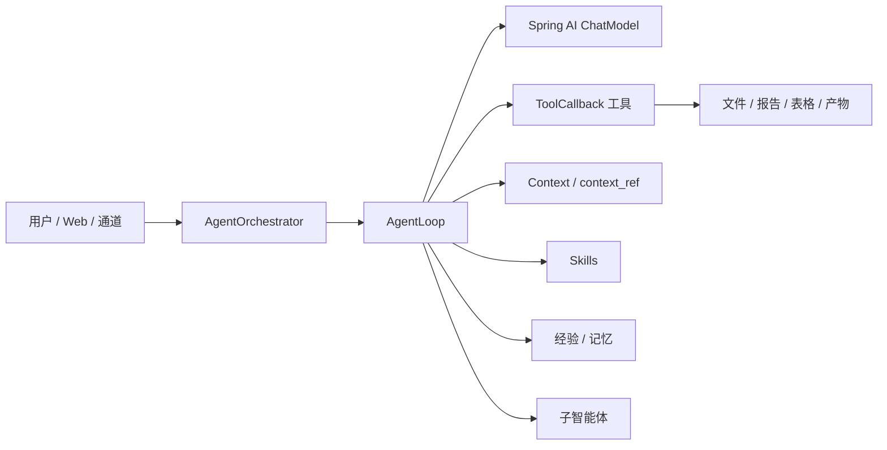

# JobClaw

JobClaw 是一个基于 Spring Boot 4 和 Spring AI 2 的智能体运行框架。它的目标不是做一个简单聊天壳，而是让模型能够在真实工作区里调用工具、读取资料、生成文件、执行脚本、调用技能、派生子智能体，并把执行过程、上下文、经验和产物都沉淀下来。

当前主线已经切换到 Spring AI 2 架构：

- Java 25
- Spring Boot 4
- Spring AI 2.0.0-M8
- OpenAI compatible provider
- Spring AI DeepSeek 原生模块
- 工具调用基于 Spring AI `ToolCallback`
- 单次 LLM 调用统一收敛到 `SpringAiLlmClient`

## 热点能力

JobClaw 的重点不是“能聊天”，而是让智能体在复杂任务里更不容易跑散。下面这些能力是当前主线最值得关注的地方。

| 能力 | 解决什么问题 | 用户能得到什么 |
| --- | --- | --- |
| Skill Harness / Managed Runner | 批量任务容易漏项、重复、半路断掉 | 对文件夹、论文集、表格批处理时，框架按 item 推进并记录状态 |
| 经验记忆增强 | 模型容易重复犯错，或者错误套用旧经验 | 经验只作为保守提示，按任务类型和对象类型筛选，避免把旧路径、旧 manifest 硬套到新任务 |
| context_ref | 工具结果和子智能体结果太长 | 大结果落盘成引用，模型按需读取、搜索、摘要，不把上下文撑爆 |
| completion 产物兜底 | 模型口头说完成，但文件没生成 | 最终回答前检查文件是否真实存在、非空，并要求模型修复 |
| 用户交互暂停 | 任务中途必须确认，但框架只会往前冲 | 模型可以请求用户输入，前端显示等待状态，而不是误判失败 |
| 上传资料到 workspace | 用户资料无法自然进入任务 | 前端上传后把本地路径交给智能体，后续可直接读取 PDF、Word、Excel |
| 动态工具注入 | 工具太多会干扰模型 | 按任务 profile、skill 和角色选择工具，普通任务默认保持轻量 |
| Spring AI 2 原生适配 | 自建 HTTPProvider 难维护 | DeepSeek、OpenAI compatible 等统一走 Spring AI 客户端体系 |

## 核心定位

JobClaw 关注的是“能把任务做完”的智能体运行时。

它适合处理这类任务：

- 读取一个文件夹里的论文、文档、表格，生成综述、报告或结构化数据
- 调用脚本或命令完成本地处理
- 使用技能卡片约束复杂工作流
- 长任务分批执行并留下中间结果
- 多智能体协作、角色分工、共享记录
- 把执行痕迹、经验、产物路径和用户交互状态保存下来

它不把所有任务都强行规划成复杂流程。默认路径仍然是直接执行：用户输入进入 `AgentOrchestrator`，再由 `AgentLoop` 驱动模型和工具完成任务。

## 运行模型


```mermaid
flowchart LR
    User["用户 / Web / 通道"] --> Orchestrator["AgentOrchestrator"]
    Orchestrator --> Loop["AgentLoop"]
    Loop --> Model["Spring AI ChatModel"]
    Loop --> Tools["ToolCallback 工具"]
    Loop --> Context["Context / context_ref"]
    Loop --> Skills["Skills"]
    Loop --> Memory["经验 / 记忆"]
    Loop --> Agents["子智能体"]
    Tools --> Artifacts["文件 / 报告 / 表格 / 产物"]
```

### LLM 调用入口

主智能体循环由 `AgentLoop` 直接使用 Spring AI `ChatClient` / `ChatModel`。

非主循环的简单 LLM 调用，例如经验复盘中的文本精炼，统一使用：

```text
JobClaw -> SpringAiLlmClient -> Spring AI ChatClient / ChatModel
```

旧的 `LLMProvider`、`LLMResponse`、`SpringAiLLMProvider`、`ToolDefinition` 兼容层已经移除。`Message` 和 `ToolCall` 仍保留，因为它们现在是会话、上下文和投影数据结构的一部分。

## 快速开始

### 环境要求

- JDK 25
- Maven 3.9+
- 可访问的 LLM Provider
- Windows / Linux / macOS 均可运行，当前开发测试主要在 Windows 环境

### 编译与测试

```bash
mvn clean test
mvn -DskipTests package
```

打包后产物位于：

```text
target/jobclaw-1.0.0.jar
```

### 初始化配置

```bash
java -jar target/jobclaw-1.0.0.jar onboard
```

默认配置路径：

```text
~/.jobclaw/config.json
```

默认工作区：

```text
~/.jobclaw/workspace
```

### 启动 Web / Gateway

```bash
java -jar target/jobclaw-1.0.0.jar gateway
```

默认 Web 地址：

```text
http://127.0.0.1:18791
```

仓库中也提供了 Windows 启动脚本：

```bat
run.bat
```

## Provider 配置

JobClaw 通过 `config.json` 管理 provider、模型、工作区和运行参数。`application.yml` 中的 Spring AI 配置主要作为 Spring 启动占位和默认值，实际运行以 JobClaw 配置为准。

典型 provider 包括：

- DashScope OpenAI compatible
- DeepSeek
- LM Studio
- Ollama OpenAI compatible
- vLLM OpenAI compatible
- 其他兼容 OpenAI Chat Completions 的服务

### DeepSeek

DeepSeek 已切换到 Spring AI 的 `spring-ai-deepseek` 原生模块。

DeepSeek 思考模型会走 DeepSeek 原生客户端，不再通过旧 HTTPProvider 旁路。对于需要 `reasoning_content` 的模型，应由 Spring AI DeepSeek 模块处理协议差异。

### OpenAI Compatible Provider

除 DeepSeek 外，OpenAI compatible provider 走 Spring AI OpenAI 模型入口。需要注意的是，不同本地服务对 OpenAI 协议的兼容程度不同，尤其是流式输出、工具调用和 vendor-specific 字段。

如果使用 LM Studio、Ollama 或 vLLM，请确认它们暴露的是兼容 `/v1` 的 base URL。

Qwen 通过 vLLM 提供服务时，可在主智能体配置中设置 `thinkingTokenBudget`。正整数会作为
`thinking_token_budget` 发送给 vLLM，用于限制单次推理使用的思考 token；设置为 `0` 时不发送该字段。
该参数不会发送给 DashScope、OpenRouter 官方接口、Ollama 或非 Qwen 模型。

对于支持推理强度的 OpenAI-compatible 服务（例如 SGLang），可设置 `reasoningEffort`：
`auto`、`minimal`、`low`、`medium`、`high`、`xhigh` 或 `max`。除 `auto` 外，JobClaw 会发送
`reasoning: { "effort": "..." }`；`auto` 表示不发送该字段，由服务端采用默认强度。
显式设置 `reasoningEffort` 时，它优先于 `thinkingTokenBudget`，避免同时向服务端发送两套推理预算。

## 工具系统

JobClaw 工具基于 Spring AI `@Tool` 和 `ToolCallback` 暴露给模型。工具不是一次性全部无脑注入，而是根据任务 profile、skill 和上下文动态选择。

常用工具包括：

| 工具 | 作用 |
| --- | --- |
| `skills` | 列出、调用、安装、创建和搜索技能 |
| `run_command` | 执行本地命令或脚本 |
| `read_file` / `write_file` / `append_file` / `edit_file` | 文件读写与编辑 |
| `list_dir` | 列出目录，返回可复用的精确路径 |
| `read_pdf` / `read_word` / `read_excel` | 读取 PDF、Word、Excel |
| `context_ref` | 读取、搜索、摘要化超长工具结果 |
| `manifest` | 显式多项任务台账 |
| `completion` | 注册最终产物检查 |
| `user_input` | 在必要时请求用户补充信息并暂停 |
| `memory` | 显式长期记忆管理 |
| `spawn` | 派生一个子智能体执行有边界的任务 |
| `collaborate` | 多智能体协作 |
| `agent_catalog` | 管理可复用持久智能体 |
| `board_write` / `board_read` | 多智能体共享白板 |
| `web_search` / `web_fetch` | 搜索和读取网页 |
| `query_token_usage` | 查询 token 使用统计 |
| `cron` | 创建定时任务或提醒 |
| `mcp` | 连接 MCP 服务 |
| `message` | 向外部通道发送消息 |

`exec` 已标记为 deprecated。普通路径和 skill 路径默认使用 `run_command`，`exec` 仅作为兼容保留，不进入默认工具集。

## 工具注入策略

JobClaw 不希望每次都把所有工具塞给模型。工具注入按 profile 选择：

- 普通任务默认注入基础工具：`skills`、`context_ref`、`manifest`、`completion`、`user_input`、`list_dir`、`read_file`、`run_command`
- 文档任务补充：`read_pdf`、`read_word`、`write_file`、`append_file`
- 表格任务补充：`read_excel`、`write_file`、`append_file`
- 代码任务补充：`write_file`、`edit_file`、`append_file`
- Web 任务补充：`web_search`、`web_fetch`
- 多智能体任务补充：`spawn`、`collaborate`、`agent_catalog`、`board_write`、`board_read`
- 用量查询任务补充：`query_token_usage`

profile 由确定性规则从用户输入、skill 元信息、角色和任务上下文中判断，不额外调用模型做路由，避免增加延迟和不稳定性。

## Skills

Skill 是 JobClaw 处理复杂任务的重要机制。它不是普通提示词片段，而是可复用的任务说明、工具约束和执行合同。

典型 skill 可以规定：

- 什么时候使用它
- 需要先读取哪些文件或目录
- 允许使用哪些工具
- 是否使用 managed runner
- 每个 item 的输出格式
- 中间文件和最终文件保存在哪里
- 什么时候必须询问用户

外部 skill 通常放在工作区技能目录，例如：

```text
E:\jobwork\skills
```

示例：

- `batch-document-extract-excel`：批量读取文档，抽取字段，生成 Excel
- `paper-folder-literature-review`：读取论文文件夹，生成综述或研究笔记

## Skill Harness

这里的 harness 指的是 JobClaw 为 skill 提供的一套运行护栏和执行框架。它不是替模型思考，也不是把所有任务都强行拆成流程，而是在 skill 明确声明后，把容易机械出错的部分交给框架处理。

Skill Harness 主要包含：

- skill 激活状态：记录当前任务正在执行哪个 skill
- 工具白名单：item 执行时只给 skill 允许的工具
- manifest 合同：记录真实 item 列表、状态、中间产物和最终产物预期
- managed runner：按 item 推进执行，不让模型在一个 item 里重启整个批处理
- item 输出合同：要求单项结果是 JSON、文本、Markdown 或文件路径
- 中间结果保存：把每个 item 的原始输出保存为 context_ref 或 item 文件
- 聚合产物维护：可持续追加 JSONL、Markdown 或 JSON array
- finalize 交还：item loop 完成后，把控制权交回主模型生成最终文件

它适合：

- 多文件抽取
- 批量论文阅读
- 多表格检查
- 大目录巡检
- 可以拆成独立 item 的长任务

它不适合：

- 普通问答
- 单文件编辑
- 强依赖全局推理的开放任务
- 需要模型自由探索、频繁改变步骤的任务

JobClaw 对 harness 的设计是保守的：只有 skill 明确声明 `mode: runner`，并且模型显式创建 `executionMode=managed` 的 manifest，框架才接管 item loop。普通 direct 任务不会被框架偷偷改造成批处理。

## Manifest 与长任务

`manifest` 是显式多项任务台账，用于记录批量任务的每个 item 状态。

它支持：

- `pending`
- `running`
- `done`
- `failed`
- 中间产物路径
- 最终产物预期路径

直接对话中的 manifest 只是台账，不会自动接管执行。

只有满足以下条件，框架才会进入 managed runner：

1. 当前任务激活了 skill
2. skill 声明 `mode: runner`
3. 模型调用 `manifest.create`
4. `executionMode=managed`
5. skill 提供 item 列表、输出格式、工具白名单和产物路径合同

managed runner 会负责推进每个 item 的执行、保存中间结果、更新 manifest 状态，但最终报告或最终表格仍由 skill 的 finalize 步骤完成。

## context_ref

工具结果过长时，JobClaw 会把完整内容保存为 `context_ref`，只把引用、摘要和预览交给模型。

这样可以避免：

- 超长工具输出挤爆上下文
- 模型被大量无关内容干扰
- 子智能体结果一次性塞回主线程

模型需要细节时，可以调用 `context_ref` 做：

- `read`
- `search`
- `summary`
- `list`

`context_ref` 是结果存储和上下文压缩机制，不是任务调度器，也不是自动缓存。

## Completion 产物兜底

当用户要求“生成 Word / 保存 Excel / 输出 PDF / 写入报告”时，JobClaw 可以通过 `completion` 注册最终检查。

支持的检查包括：

- `file_exists`
- `file_non_empty`
- `directory_exists`
- `directory_non_empty`
- `manifest_done`
- `artifact_expected`

如果模型最终回答声称任务完成，但没有真的生成文件，或者最终回答没有包含可验证的文件路径，框架会拦截最终回答，并给模型一次修复提示。

这套机制只在最终回答前检查，不会中途打断普通执行流程。

## 用户交互

有些任务必须中途询问用户，例如：

- skill 明确要求用户确认字段或范围
- 缺少必要路径、账号、凭证或决策
- 继续执行可能覆盖文件或造成风险
- 用户要求的最终产物依赖中间选择

模型可以调用 `user_input` 工具。框架会记录等待状态并暂停当前 run，让前端知道此时不是失败，而是在等待用户补充。

## 文件上传

Web 前端支持上传资料。上传文件会保存到 workspace 下的上传目录，并把文件路径随用户消息一起传给智能体。

智能体看到的是本地绝对路径，可以继续使用 `read_file`、`read_pdf`、`read_word`、`read_excel` 等工具读取。

上传目录按会话和时间分层，便于追踪每次任务使用了哪些用户资料。

## 经验与记忆

JobClaw 有两类长期沉淀：

### 记忆

通过 `memory` 工具显式写入，适合保存用户偏好、项目事实、长期规则。

### 经验

经验来自执行过程中的候选总结和人工筛选，用来帮助后续任务避免重复失败。

经验注入是保守的：相似不代表相关。系统会尽量避免把“看起来像”的旧任务经验硬套到当前任务上，尤其是涉及路径、文件夹、删除、覆盖、批处理这类高风险操作时。

经验增强重点做了几件事：

- 提取任务签名：区分文件处理、GitHub、文档综述、清理目录、批处理等任务类型
- 提取对象类型：例如 folder、file、paper、issue、spreadsheet
- 过滤易污染内容：旧路径、旧 manifestId、旧 artifactPath、旧 pending/done 计数不会作为可复用指令注入
- 记录用户态：支持 pin、forget、accept、reject，避免系统自己把所有候选都当成真经验
- 注入为 guidance：经验只提示流程和风险，不覆盖当前用户明确路径和目标
- 复盘报告：定期或手动生成 `.jobclaw/experience/latest.md`，供用户审阅

例如，历史经验里有“清理 D:\old\folder 前先 dry-run”，当前用户要求“清理 E:\new\data”。系统可以注入“清理前先 dry-run 和确认目标路径”这个流程经验，但不会把 `D:\old\folder` 当成当前目标。

经验复盘可以生成 `.jobclaw/experience` 下的报告，并在启用 LLM review 时调用 `SpringAiLlmClient` 做精炼。

## 多智能体

JobClaw 支持两种多智能体能力：

### spawn

派生一个子智能体处理有边界的任务，例如：

- 总结一个文件
- 检查一组结果
- 写一个局部章节

### collaborate

启动多角色协作，支持：

- `TEAM`
- `SEQUENTIAL`
- `DEBATE`

多智能体可以使用共享白板：

- `board_write`
- `board_read`

共享白板用于记录事实、结论、风险、产物路径和决策，避免不同智能体之间只靠长上下文传递信息。

## Web 与通道

JobClaw 有 Web Console，也可以对接多种外部通道。

当前内置通道能力包括：

- Web
- 飞书 / Lark
- Telegram
- Discord
- MaixCam

通道接入由总线和 `ChannelManager` 管理，不影响核心 AgentLoop。不同通道的消息进入系统后，都会转成统一任务交给智能体运行时。

## 语音能力

本地语音能力由 sidecar 提供。相关接口包括：

- `GET /api/voice/status`
- `GET /api/voice/voices`
- `POST /api/voice/transcribe`
- `POST /api/voice/tts`

默认期望本地存在：

```text
voice-sidecar-local/
  python/python.exe
  models/asr/faster-whisper-small/model.bin
  models/tts/...
```

如果 sidecar 或模型不存在，前端会禁用语音能力，并显示不可用状态。

## 重要目录

以 workspace 为根目录，JobClaw 会使用这些目录保存状态：

| 目录 | 作用 |
| --- | --- |
| `.jobclaw/agents/` | 持久智能体定义 |
| `.jobclaw/experience/` | 经验记忆和复盘报告 |
| `.jobclaw/learning/` | 待审核学习候选 |
| `.jobclaw/results/` | context_ref 大结果 |
| `.jobclaw/manifests/` | 多项任务台账 |
| `sessions/conversation/` | 对话、摘要和检索索引 |
| `sessions/conversation/boards/` | 多智能体共享白板 |
| `uploads/` | Web 上传资料 |
| `cron/` | 定时任务 |

## 常用命令

```bash
# 初始化
java -jar target/jobclaw-1.0.0.jar onboard

# 启动网关和 Web Console
java -jar target/jobclaw-1.0.0.jar gateway

# CLI 对话
java -jar target/jobclaw-1.0.0.jar agent

# 查看状态
java -jar target/jobclaw-1.0.0.jar status

# 运行 demo
java -jar target/jobclaw-1.0.0.jar demo agent-basic
java -jar target/jobclaw-1.0.0.jar demo agent-multi
```

## 开发说明

### 测试

```bash
mvn test
```

测试环境显式配置 Mockito javaagent，以兼容较新的 JDK。

### 打包

```bash
mvn -DskipTests package
```

如果打包时报错无法重命名 jar，通常是旧的 `jobclaw-1.0.0.jar` 进程仍在运行。停止旧进程后重新打包即可。

### 前端

当前仓库主构建默认跳过前端构建：

```xml
<skip.frontend>true</skip.frontend>
```

静态资源位于：

```text
src/main/resources/static
```

## 设计原则

JobClaw 当前主线坚持几个原则：

1. 默认直接执行，不让框架过度接管普通任务。
2. 长任务用文件、manifest、context_ref 和 completion gate 保证可靠性。
3. 工具注入要保守，避免无关工具干扰模型。
4. skill 是复杂流程的主要承载方式。
5. 经验只作为谨慎提示，不覆盖当前用户明确指令。
6. 对 Spring AI 的适配尽量走原生模块，减少旁路和重复抽象。
7. 最终回答必须尊重真实产物，不能只“口头完成”。

## 当前主线状态

当前 `master` 已切换到 Spring Boot 4 + Spring AI 2 主线。旧 master 已保存为历史维护分支：

```text
maintenance/master-pre-springai2-cutover-20260603
```

后续新功能应优先基于当前 `master` 开发。
