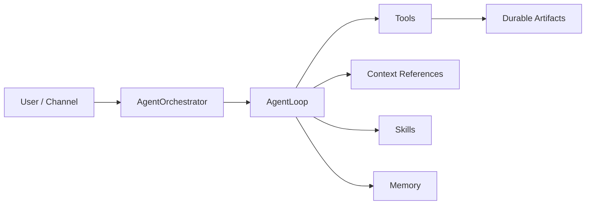

# JobClaw

JobClaw is a Spring Boot based agent runtime. The current runtime uses a direct execution chain: user input is routed to `AgentOrchestrator`, executed by `AgentLoop`, and supported by tools, context references, durable artifacts, memory, skills, and optional child agents.

## Runtime Model


```mermaid
flowchart LR
    User["User / Channel"] --> Orchestrator["AgentOrchestrator"]
    Orchestrator --> Loop["AgentLoop"]
    Loop --> Tools["Tools"]
    Loop --> ContextRefs["Context References"]
    Loop --> Skills["Skills"]
    Loop --> Memory["Memory"]
    Tools --> Artifacts["Durable Artifacts"]
```

The runtime no longer contains the old implicit planning executor. Long task reliability should come from:

- bounded tool output and `context_ref` for large results
- durable intermediate artifacts
- concise progress summaries
- explicit skills for repeatable procedures
- child agents only when the model or user intentionally requests collaboration

## Execution Reliability

JobClaw keeps the main execution path direct. The framework should enhance execution without taking over task planning.

### Context references

Large tool or child-agent results can be externalized into `context_ref`. The model receives a reference, preview, and metadata instead of the full payload. When it needs details, it should call `context_ref` to read, search, or summarize only the required part.

`context_ref` is result storage, not an automatic tool cache and not a task controller.

### Manifest ledger

For explicit multi-item work, the model or a skill can create a manifest ledger:

- `total`
- `pending`
- `running`
- `done`
- `failed`
- `artifactPath`

The framework records manifest events and exposes progress to the UI. It does not infer multi-item work from regexes or automatically split tasks. A manifest starts only when the model or skill explicitly calls the manifest tool.

### Completion gate

For tasks with required output artifacts, the model or skill can register a completion contract with the `completion` tool. This is a final-response guard only:

- It does not run the task.
- It does not interrupt normal execution.
- It only checks before the final response is accepted.

Two styles are supported:

- Concrete checks: `file_exists`, `file_non_empty`, `directory_exists`, `directory_non_empty`, `manifest_done`
- Generic artifact checks: `artifact_expected` with an `artifactType` and optional `outputDir`

For `artifact_expected`, the final response must include the full generated artifact path. The framework extracts the path and verifies it exists and is non-empty. Known types such as `xlsx`, `pdf`, `jsonl`, `csv`, `docx`, `md`, `html`, `pptx`, `zip`, and `txt` use extension-aware path extraction. Unknown artifact types are still valid: the final response must include one concrete absolute path, and that path is checked for existence and non-empty content.

If the final response does not include a usable path, or the artifact check fails, JobClaw returns a recovery prompt to the model with the failed check and the previous final-response candidate as context. This prevents false completion while avoiding mid-task intervention.

If no completion contract is registered, the run behaves like an ordinary direct conversation.

## Skills

Skills should describe repeatable workflows and tool usage constraints. They are not built into the application jar by default; external skill directories can be configured by deployment.

For long artifact-producing skills, the recommended pattern is:

1. Create or reuse a manifest when the job has explicit multiple items.
2. Write intermediate results to durable files as each item completes.
3. Register a completion contract for the required artifact type or concrete output path.
4. Generate final artifacts from intermediate files with existing tools or scripts.
5. Include the final artifact path in the final response.

## Voice

The current branch includes local voice endpoints:

- `GET /api/voice/status`
- `GET /api/voice/voices`
- `POST /api/voice/transcribe`
- `POST /api/voice/tts`

Voice requires a local sidecar runtime under `voice-sidecar-local` or a configured `jobclaw.voice.root`. The default local layout expects:

- `python/python.exe`
- `models/asr/faster-whisper-small/model.bin`
- a TTS model directory, by default Kokoro under `models/tts/Kokoro-82M-v1.1-zh`

If the runtime or models are missing, the frontend disables voice controls and reports voice as unavailable.

## Important Directories

- `.jobclaw/agents/`: persistent agent catalog
- `.jobclaw/experience/`: user accepted experience memory and review reports
- `.jobclaw/learning/`: pending learning candidates
- `.jobclaw/results/`: large tool and child-agent results stored behind context references
- `.jobclaw/manifests/`: explicit multi-item task ledgers
- `sessions/conversation/`: conversation and summary storage
- `cron/`: scheduled jobs

## Build And Test

```bash
mvn clean test
mvn -DskipTests package
```

The test setup pins ByteBuddy and runs Mockito as an explicit test javaagent so tests work on newer JDKs.
