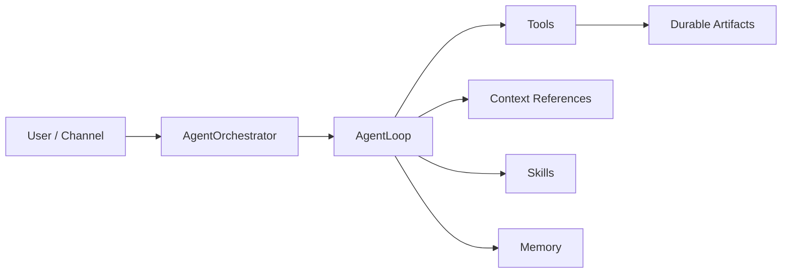

# JobClaw

JobClaw is a Spring Boot based agent runtime. The current runtime uses a direct execution chain: user input is routed to `AgentOrchestrator`, executed by `AgentLoop`, and supported by tools, context references, durable artifacts, memory, skills, and optional child agents.

## Runtime Model


```mermaid
flowchart LR
    User["User / Channel"] --> Orchestrator["AgentOrchestrator"]
    Orchestrator --> Loop["AgentLoop"]
    Loop --> Tools["Tools"]
    Loop --> ContextRefs["Context References"]
    Loop --> Skills["Skills"]
    Loop --> Memory["Memory"]
    Tools --> Artifacts["Durable Artifacts"]
```

The runtime no longer contains the old implicit planning executor. Long task reliability should come from:

- bounded tool output and `context_ref` for large results
- durable intermediate artifacts
- concise progress summaries
- explicit skills for repeatable procedures
- child agents only when the model or user intentionally requests collaboration

Direct execution remains the default. The framework records and protects execution state, but it should not guess a plan or silently take control of ordinary direct tasks.

## Execution Reliability

JobClaw keeps the main execution path direct. The framework should enhance execution without taking over task planning.

### Context references

Large tool or child-agent results can be externalized into `context_ref`. The model receives a reference, preview, and metadata instead of the full payload. When it needs details, it should call `context_ref` to read, search, or summarize only the required part.

`context_ref` is result storage, not an automatic tool cache and not a task controller.

### Manifest ledger

For explicit multi-item work, the model or a skill can create a manifest ledger:

- `total`
- `pending`
- `running`
- `done`
- `failed`
- `artifactPath`

The framework records manifest events and exposes progress to the UI. It does not infer multi-item work from regexes or automatically split tasks. A manifest starts only when the model or skill explicitly calls the manifest tool.

Creating a manifest in a normal direct run does not automatically start a framework-owned item loop. In direct mode, the manifest is a ledger only; the model still drives the work.

### Managed manifest runner

JobClaw supports an opt-in managed item loop for repeatable long tasks. This path is intentionally narrow.

The runner starts only when all of these are true:

- the current run has activated a skill
- the active skill declares `mode: runner`
- the skill calls `manifest.create` with `executionMode=managed`
- the manifest contract includes the required item list, schema, and artifact paths

In this mode, the main model creates the manifest, then the framework takes over the mechanical item loop:

1. Select one pending item.
2. Render one skill-defined execution card for that item.
3. Give the item model only the skill-allowed tools.
4. Save the item result to the skill-defined item artifact path.
5. Append the result to the intermediate aggregate artifact.
6. Mark the manifest item `done` or `failed`.
7. Continue until `pending=0` and `running=0`.
8. Return control to the main model for the skill-defined finalize step.

The framework does not parse business meaning from item results. It only stores the structured result returned by the model, updates the manifest, and keeps the loop moving. A malformed tool call or failed item should mark that item failed and continue, rather than blocking the entire job.

If there is no active runner skill, `executionMode=managed` in a direct prompt is not enough to trigger the runner. This protects ordinary direct tasks from accidental takeover.

### Completion gate

For tasks with required output artifacts, the model or skill can register a completion contract with the `completion` tool. This is a final-response guard only:

- It does not run the task.
- It does not interrupt normal execution.
- It only checks before the final response is accepted.

Two styles are supported:

- Concrete checks: `file_exists`, `file_non_empty`, `directory_exists`, `directory_non_empty`, `manifest_done`
- Generic artifact checks: `artifact_expected` with an `artifactType` and optional `outputDir`

For `artifact_expected`, the final response must include the full generated artifact path. The framework extracts the path and verifies it exists and is non-empty. Known types such as `xlsx`, `pdf`, `jsonl`, `csv`, `docx`, `md`, `html`, `pptx`, `zip`, and `txt` use extension-aware path extraction. Unknown artifact types are still valid: the final response must include one concrete absolute path, and that path is checked for existence and non-empty content.

If the final response does not include a usable path, or the artifact check fails, JobClaw returns a recovery prompt to the model with the failed check and the previous final-response candidate as context. This prevents false completion while avoiding mid-task intervention.

If no completion contract is registered, the run behaves like an ordinary direct conversation.

## Skills

Skills should describe repeatable workflows and tool usage constraints. They are not built into the application jar by default; external skill directories can be configured by deployment.

For long artifact-producing skills, the recommended pattern is:

1. List the real input items with tools, not examples or placeholders.
2. Create or reuse a manifest when the job has explicit multiple items.
3. Let `mode: runner` skills use the managed runner for per-item work.
4. Choose result sinks explicitly: raw item output is always safest as a `context_ref`; item files and aggregate files are optional skill choices.
5. Generate final artifacts from intermediate refs/files with existing tools or scripts.
6. Include the final artifact path in the final response.

A runner skill should define its own runtime contract, for example:

```text
mode: runner
parallelism: 1
frameworkWrites: item-json,jsonl,manifest
resultSink: both
aggregateSink: jsonl
itemResultPathTemplate: {{task.inputDir}}\results.items\{{item.safeId}}.json
aggregatePathTemplate: {{artifactPath}}
itemOutput: json_object
allowedTools: read_pdf, read_word, read_file, context_ref
```

Managed runtime fields:

- `mode: runner`: enables framework-managed item execution only when the model also creates a managed manifest.
- `parallelism`: number of managed item workers to run concurrently. Default is `1`; values above `8` are capped. Use `1` unless the skill's per-item tools and output sinks are safe to run in parallel.
- `itemOutput`: model contract for one item. Supported values are `json_object`, `text`, `markdown`, and `file_path`.
- `resultSink`: where the framework stores each item result. `context_ref` stores only the raw model output reference; `item_file` writes only the rendered item artifact; `both` does both. If omitted, JobClaw uses `both` when `itemResultPathTemplate` exists, otherwise `context_ref`.
- `aggregateSink`: how the framework maintains a batch-level intermediate artifact. Supported values are `jsonl`, `json_array`, `markdown`, and `none`. If omitted, JobClaw uses `jsonl` when `aggregatePathTemplate` exists, otherwise `none`.
- `itemResultPathTemplate`: required only when `resultSink` is `item_file` or `both`.
- `aggregatePathTemplate`: required only when `aggregateSink` is not `none`.
- `allowedTools`: local allowlist for the item loop.

The `allowedTools` list is local to the item loop. It should be as small as practical so the model cannot restart the whole workflow from inside one item.

Do not force every runner skill into the same shape. A document extraction skill may use `resultSink=both` and `aggregateSink=jsonl`; a literature-review notes skill may use `resultSink=context_ref` and `aggregateSink=markdown`; an inspection skill may use `aggregateSink=none` and rely only on manifest status plus item refs.

Skills can still support resume behavior. If item artifacts already exist and are complete, the skill may reuse them and skip re-reading source files. If only part of the work exists, the skill should create a manifest only for missing items or use the existing manifest to continue.

Example external skills used in testing:

- `batch-document-extract-excel`: per-document extraction to item JSON/JSONL, then Excel generation.
- `paper-folder-literature-review`: per-paper research notes, then Markdown literature review generation.

These skills live outside the jar in the configured skills directory, such as `E:\jobwork\skills`.

## Long Task Guidance

For direct long-form work, make the prompt artifact-oriented. Ask the model to create files with `write_file` and extend them with `append_file`, then verify the result with a tool. Do not ask for a 40,000-character report as one chat response.

Recommended direct pattern:

1. Write an outline file.
2. Create the final report file.
3. Append one section at a time.
4. Check size or completeness with a tool.
5. Continue until the target is satisfied.
6. Return only paths and validation facts in the final answer.

For multi-object long tasks, prefer a runner skill. Direct prompts can work for small batches, but they do not get the managed item loop unless a runner skill is active.

## Provider Notes

### DeepSeek

DeepSeek-compatible providers can return reasoning side-channel content. JobClaw disables DeepSeek thinking for non-reasoner DeepSeek models to avoid providers requiring `reasoning_content` to be replayed across tool calls.

Built-in model entries include:

- `deepseek-chat`
- `deepseek-reasoner`
- `deepseek-v4-flash` when configured through the provider/model settings

For non-reasoner DeepSeek models, JobClaw sends `thinking: { "type": "disabled" }` where supported and uses a safer non-stream call path to avoid incompatible reasoning-content replay behavior.

## Voice

The current branch includes local voice endpoints:

- `GET /api/voice/status`
- `GET /api/voice/voices`
- `POST /api/voice/transcribe`
- `POST /api/voice/tts`

Voice requires a local sidecar runtime under `voice-sidecar-local` or a configured `jobclaw.voice.root`. The default local layout expects:

- `python/python.exe`
- `models/asr/faster-whisper-small/model.bin`
- a TTS model directory, by default Kokoro under `models/tts/Kokoro-82M-v1.1-zh`

If the runtime or models are missing, the frontend disables voice controls and reports voice as unavailable.

## Important Directories

- `.jobclaw/agents/`: persistent agent catalog
- `.jobclaw/experience/`: user accepted experience memory and review reports
- `.jobclaw/learning/`: pending learning candidates
- `.jobclaw/results/`: large tool and child-agent results stored behind context references
- `.jobclaw/manifests/`: explicit multi-item task ledgers
- `sessions/conversation/`: conversation and summary storage
- `cron/`: scheduled jobs

## Build And Test

```bash
mvn clean test
mvn -DskipTests package
```

The test setup pins ByteBuddy and runs Mockito as an explicit test javaagent so tests work on newer JDKs.
