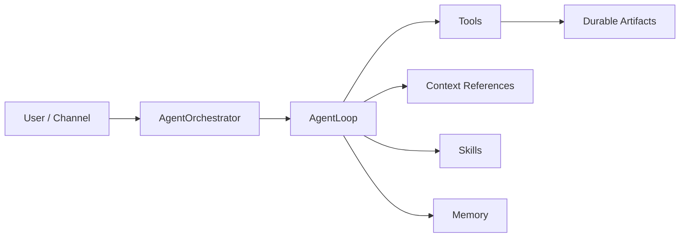

# JobClaw

JobClaw is a Spring Boot based agent runtime. The current runtime uses a direct execution chain: user input is routed to `AgentOrchestrator`, executed by `AgentLoop`, and supported by tools, context references, durable artifacts, memory, skills, and optional child agents.

## Runtime Model


```mermaid
flowchart LR
    User["User / Channel"] --> Orchestrator["AgentOrchestrator"]
    Orchestrator --> Loop["AgentLoop"]
    Loop --> Tools["Tools"]
    Loop --> ContextRefs["Context References"]
    Loop --> Skills["Skills"]
    Loop --> Memory["Memory"]
    Tools --> Artifacts["Durable Artifacts"]
```

The runtime no longer contains the old implicit planning executor. Long task reliability should come from:

- bounded tool output and `context_ref` for large results
- durable intermediate artifacts
- concise progress summaries
- explicit skills for repeatable procedures
- child agents only when the model or user intentionally requests collaboration

## Important Directories

- `.jobclaw/agents/`: persistent agent catalog
- `.jobclaw/experience/`: user accepted experience memory and review reports
- `.jobclaw/learning/`: pending learning candidates
- `.jobclaw/results/`: large tool and child-agent results stored behind context references
- `sessions/conversation/`: conversation and summary storage
- `cron/`: scheduled jobs

## Build And Test

```bash
mvn clean test
mvn -DskipTests package
```

The test setup pins ByteBuddy and runs Mockito as an explicit test javaagent so tests work on newer JDKs.
