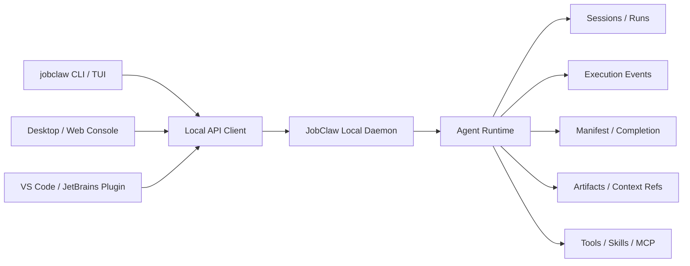

# JobClaw CLI And Local Daemon Runtime Plan

## Goal

JobClaw should evolve from a web-console-oriented Spring Boot agent runtime into a task-completion runtime that works well on Linux, remote servers, local desktops, and future IDE or desktop clients.

The target shape is:



The CLI should become the first-class Linux interface. The daemon should become the stable control plane for CLI, web UI, desktop UI, and future IDE integrations.

This plan intentionally keeps the existing executor. The main work is to change the interaction model and add missing lifecycle surfaces around it. JobClaw should not fork into a second runtime for CLI.

## Current Baseline

The current code already has several useful building blocks:

- `io.jobclaw.cli`: command registry and simple commands such as `agent`, `status`, `skills`, `mcp`.
- `AgentOrchestrator`: direct runtime entry point with event callback support.
- `AgentLoop`: synchronous execution engine for a session prompt.
- `ExecutionEvent`: structured event model with `runId`, `sessionId`, agent metadata, tool events, and final response.
- `ExecutionTraceService`: in-memory and persisted event history under `sessions/execution`.
- `SessionManager`: persisted append-only conversation history.
- `ManifestTool`: explicit multi-item task ledger under `.jobclaw/manifests`.
- `CompletionTool` and completion registry: final-response contract checking.
- `WebConsoleController`: existing REST/SSE controller for status, chat, and execution streaming.

The main missing layer is a first-class "run" abstraction and a better terminal interaction shell. Today a prompt can produce a `runId` inside execution events, but there is no durable run registry that owns lifecycle, status, command attachment, log replay, artifacts, cancellation, or resume semantics.

The existing executor should remain:

```text
CLI / Web / Daemon
  -> RunService wrapper
  -> AgentOrchestrator
  -> AgentLoop
  -> ToolRuntime / tools / skills / manifest / completion
```

`RunService` is not a new executor. It is a lifecycle and event wrapper around the existing direct execution path.

## Product Principles

1. Task completion is the product, not chat.
2. CLI must work over SSH, tmux, containers, and headless Linux.
3. Desktop and web UI should be observers/controllers of the same daemon, not separate runtimes.
4. Every meaningful task should have a durable run record.
5. Every long task should be attachable after disconnect.
6. Final success must be tied to artifacts, completion checks, or explicit final response, not just model text.
7. APIs should expose events and artifacts in a client-neutral shape.
8. The agent executor remains the existing `AgentOrchestrator` and `AgentLoop`; CLI work should reuse, not bypass, the current infrastructure.

## Reuse-First Architecture

The implementation should treat current JobClaw infrastructure as the source of truth.

### Reused Infrastructure

| Existing component | Role in CLI/daemon plan |
| --- | --- |
| `AgentOrchestrator` | Primary execution entry point for all task runs. |
| `AgentLoop` | Existing model/tool loop; no separate CLI executor. |
| `AgentRegistry` | Reuse agent pooling and agent profile resolution. |
| `ExecutionEvent` | Shared event envelope for CLI streaming, SSE, logs, and attach. |
| `ExecutionTraceService` | Existing event publish/replay path; extend with run-oriented lookup rather than replacing it. |
| `SessionManager` | Conversation/session persistence and resume context. |
| `ToolRuntime` | Existing tool invocation, state tracking, budgets, and context propagation. |
| `ManifestTool` | Existing multi-item task ledger and managed runner integration. |
| `CompletionTool` / completion registry | Existing final-response gate and artifact validation. |
| `ContextRef` / result store | Existing large output storage and replay mechanism. |
| `SkillsService` / active skill registries | Existing skill discovery and runner-skill behavior. |
| `WebConsoleController` | Existing REST/SSE baseline; migrate to run APIs gradually. |

### New Code Should Be Thin

New code should mainly do these things:

- Parse terminal commands and slash commands.
- Inspect the workspace before submitting a task.
- Create and update durable run records.
- Render existing `ExecutionEvent` streams nicely in the terminal.
- Replay persisted events for `attach` and `logs`.
- Index artifacts already produced by tools, manifests, completion checks, and final responses.
- Expose the same run lifecycle through local daemon APIs.

New code should avoid:

- A second model loop.
- A second tool execution stack.
- A second session store.
- A CLI-only manifest implementation.
- A CLI-only completion checker.
- Business parsing of model output beyond conservative artifact indexing.

## Critical Design Corrections

The first draft of this plan had several implementation risks. These corrections should be treated as requirements before coding starts.

### Correction 1: Separate Project Root From JobClaw State Root

Do not use one overloaded "workspace" concept.

Use these terms consistently:

```text
stateRoot    JobClaw runtime state root from config.getWorkspacePath()
projectRoot  The user's current repository or task directory
cwd          The command working directory for a specific run
gitRoot      Detected git repository root, if any
```

Existing services such as `SessionManager`, `ExecutionTraceService`, manifests, result stores, and future run stores should keep using `stateRoot`. The CLI should inspect and operate on `projectRoot`.

Default state layout:

```text
<stateRoot>/
  sessions/
  .jobclaw/
    runs/
      index.jsonl
      run-abc123/
        run.json
        events.ndjson
        artifacts.json
```

Do not create `.jobclaw/runs` inside every user project by default. Project-local state can be an explicit future option.

### Correction 2: Preallocate The Run Id Used By AgentLoop

`RunService` must not create `run-abc123` while `AgentLoop` silently creates a different top-level run id. All events, manifests, completion contracts, context refs, and run records must share the same run id.

Implementation options, in preference order:

1. Add a small execution options object accepted by `AgentOrchestrator` / `AgentLoop`, for example `AgentExecutionOptions`, containing `runId`, `parentRunId`, `projectRoot`, `cwd`, `approvalMode`, and `source`.
2. Or extend `AgentExecutionContext.ExecutionScope` and let `RunService` pre-seed the scope before calling `AgentOrchestrator`, but only if `AgentLoop.createExecutionScope(...)` is made explicit and tested for this use.

The first option is cleaner because it avoids hidden ThreadLocal coupling.

Required invariant:

```text
RunRecord.runId == ExecutionEvent.runId == ManifestRecord.runId == CompletionContract.runId
```

### Correction 3: Make Project Root Available To Existing Tools

Storing `cwd` in `RunRecord` is not enough. Existing tools must resolve relative paths against the run's project context when a CLI run is operating inside a repository.

Current behavior to account for:

- `RunCommandTool` defaults to `System.getProperty("user.dir")` when `workingDir` is omitted.
- `FileTools` resolves relative paths against `config.getWorkspacePath()`.

For Codex/Claude Code style CLI behavior, extend the existing execution context with project path data:

```text
ExecutionScope.projectRoot
ExecutionScope.cwd
```

Then update existing tools conservatively:

- `RunCommandTool`: default `workingDir` to `ExecutionScope.cwd`, then `projectRoot`, then `System.getProperty("user.dir")`.
- `ExecTool`: same defaulting rule as `RunCommandTool`.
- `FileTools`: resolve relative paths against `ExecutionScope.projectRoot` for CLI project runs, with `config.getWorkspacePath()` as fallback.
- `ContextRefTool`, manifests, and completion checks: keep storing under `stateRoot`, but preserve absolute project artifact paths.

This is still reuse-first: the tools remain the same tools; only their run-scoped path base becomes correct.

### Correction 4: Fix CLI Bootstrap Before Building The Shell

The current `JobClawApplication` treats an empty argument list as "print help". It also disables the web server only for a small set of commands. A Codex-like CLI needs a cleaner command router.

Required bootstrap changes:

- `jobclaw` with no args should route to `AgenticCliCommand`.
- `jobclaw "task text"` should route to a direct task run, not to "unknown command".
- Runtime CLI commands should normally run with `spring.main.web-application-type=none`.
- `gateway`, `daemon start`, and explicit web/server commands should opt into web mode.
- Simple commands such as `version` should eventually avoid full Spring startup, but this is an optimization, not a blocker.

Suggested routing rule:

```text
no args                     -> agentic shell
known command               -> command registry
unknown first arg with text  -> direct task shorthand
--help / help               -> help
```

### Correction 5: Cancellation Must Be Cooperative

The current executor is synchronous. Ctrl+C cannot magically cancel a model call or a running process without support from the runtime and tools.

Phase 1 should implement a conservative cancellation model:

- Ctrl+C in foreground CLI marks the run `INTERRUPTED`.
- `RunCancellationRegistry` stores requested cancellation by `runId`.
- `AgentLoop` checks cancellation between model attempts, tool calls, and managed manifest continuations.
- Shell tools register their `Process` or `ProcessHandle` by `runId` so cancellation can terminate the active command when possible.
- If cancellation happens during an uncancellable provider call, status should become `INTERRUPTING` until control returns, then `INTERRUPTED`.

Add `INTERRUPTING` to `RunStatus` if needed.

### Correction 6: Approval Belongs At ToolRuntime Boundary

Approval should not be implemented as a second set of CLI-only tools. It should decorate the existing `ToolRuntime` invocation path so web, daemon, and CLI see the same behavior.

Recommended shape:

```text
ToolApprovalPolicy
ToolApprovalService
ApprovalRequest
ApprovalDecision
```

`ToolRuntime` asks `ToolApprovalService` before risky tools execute. CLI renders approval prompts; daemon/web can answer the same persisted request later.

### Correction 7: Split The User-Facing CLI From The Heavy Runtime Distribution

The current Maven build is a Spring Boot fat jar. It includes dependencies needed by the full runtime: web server, WebFlux, channel integrations, Office/Tika parsing, SQLite, Spring AI, frontend assets, and optional sidecars. That is appropriate for the daemon/runtime, but it is too heavy for a Codex-like command that should feel instant.

Use two distribution shapes:

```text
jobclaw                 small launcher / client CLI
jobclaw-runtime.jar     full Spring Boot runtime and daemon
```

The small `jobclaw` command should:

- parse args quickly
- render terminal UI
- inspect the project with lightweight local code
- connect to a running daemon when available
- start the runtime jar only when needed
- fall back to embedded/full runtime mode only when explicitly requested or during early Phase 1

The full runtime jar should keep:

- `AgentOrchestrator`
- `AgentLoop`
- `ToolRuntime`
- tools, skills, manifest, completion, context refs
- web console
- daemon APIs
- channel integrations
- document parsing and other heavy optional capabilities

This gives a small and fast entry command without splitting the executor.

Recommended phased packaging:

1. **Phase 1A: Same jar, better startup routing.** Fast enough to validate UX; no module split yet.
2. **Phase 1B: Small native/script launcher.** `jobclaw` is a shell/batch/native wrapper that talks to daemon or starts `jobclaw-runtime.jar`.
3. **Phase 2: Maven multi-module distribution.** Split API/client classes from runtime implementation.
4. **Phase 3: Optional native CLI.** Build a tiny GraalVM or jpackage launcher only for client-side commands if startup is still a problem.

Do not split the tool/runtime implementation early. Split only the client boundary first.

## Phase 1: Strong CLI And Background Run Capability

Phase 1 can run entirely inside the current Spring Boot process. It does not require a separately managed daemon yet. The goal is to introduce the run abstraction and make CLI task execution usable on Linux.

The desired CLI is not a thin chat wrapper. It should feel closer to Codex CLI or Claude Code: a project-aware, terminal-native task runner that can inspect a repository, edit files, run commands, stream tool activity, maintain task state, and resume after interruption.

### Agentic CLI Shape

The main entry point should be:

```bash
jobclaw
```

When launched inside a project directory, JobClaw should open an interactive agentic terminal session:

```text
JobClaw  codex/desktop-task-runtime  D:\workspace\jobclaw-desktop-task-runtime

> implement a run registry and wire jobclaw run to it

Plan
  1. Inspect existing CLI and execution flow
  2. Add run model and file store
  3. Add run command
  4. Run focused tests

Tool
  rg "class .*Command" src/main/java

Patch
  M src/main/java/io/jobclaw/cli/CliCommandRegistry.java
  A src/main/java/io/jobclaw/run/RunRecord.java

Result
  Tests passed: RunStoreTest, RunCommandTest
```

Non-interactive task execution should still exist:

```bash
jobclaw "fix the failing tests"
jobclaw run "fix the failing tests"
```

But this should use the same agentic runtime as the interactive CLI. It should not be implemented as a separate one-shot chat path.

### Agentic CLI Requirements

The CLI should support these behaviors from the start:

- **Workspace awareness**: detect current working directory, git root, branch, dirty status, build files, language stack, and project instructions.
- **Task runs**: every user request creates or resumes a durable `RunRecord`.
- **Tool streaming**: show command execution, file reads, patches, tool outputs, errors, and final response as structured terminal events.
- **Patch-first editing**: file edits should be represented as patches or changed-file summaries, not invisible side effects.
- **Approval hooks**: risky commands, network access, destructive operations, and large writes should pass through an approval policy.
- **Interrupt and resume**: Ctrl+C should not lose the run. It should mark the run interrupted and allow `jobclaw resume`.
- **Attachable execution**: background or detached runs should be attachable from another terminal.
- **Machine mode**: `--json` should emit NDJSON events for scripts and CI.
- **Terminal ergonomics**: support multiline input, command history, slash commands, and compact progress rendering.

### Interactive Commands

Inside the interactive CLI, support slash commands similar to modern coding agents:

```text
/help
/status
/plan
/runs
/attach <runId>
/resume <runId>
/logs <runId>
/artifacts <runId>
/diff
/approve
/deny
/model <name>
/agent <id>
/session <key>
/exit
```

These should be terminal commands handled by the CLI shell, not prompts sent to the model.

### Terminal UI Modes

Start simple, then improve:

1. **Plain streaming mode**: portable output that works in SSH, logs, tmux, and CI.
2. **Rich TUI mode**: optional JLine/Lanterna-style panels for plan, events, diff, and artifacts.
3. **Daemon-backed mode**: CLI becomes a thin client while retaining the same terminal UI.

The first implementation should favor plain streaming with stable event formatting. A rich TUI can come later without changing runtime APIs.

### Agentic CLI Components

Add a dedicated CLI interaction layer instead of overloading the existing `AgentCommand`.

Suggested packages:

```text
io.jobclaw.cli.shell
io.jobclaw.cli.render
io.jobclaw.cli.approval
io.jobclaw.workspace
io.jobclaw.run
```

Suggested classes:

```text
AgenticCliCommand          # default `jobclaw` entry
AgenticCliShell            # REPL loop, multiline input, slash commands
SlashCommandRouter         # handles /status, /diff, /resume, etc.
TerminalEventRenderer      # human-readable streaming output
JsonEventRenderer          # NDJSON output for --json
ApprovalPolicy             # ask/auto/readonly policy decision
ApprovalRequestStore       # persisted pending approval requests
WorkspaceInspector         # cwd, git root, branch, build files, instructions
WorkspaceContext           # immutable context passed into RunRequest
```

These classes should submit work to `RunService`; they should not call providers, tools, or model loops directly.

Keep the old `agent` command as a compatibility command:

```bash
jobclaw agent
```

But the preferred user-facing entry should become:

```bash
jobclaw
```

### Workspace Context

A Codex/Claude Code style CLI must start by understanding where it is running.

`WorkspaceInspector` should collect:

- `cwd`
- git root
- branch name
- dirty status summary
- changed files
- known build files such as `pom.xml`, `package.json`, `pyproject.toml`, `Cargo.toml`, `go.mod`
- project README paths
- local instruction files, if later supported, such as `JOBCLAW.md`, `.jobclaw/instructions.md`, or `AGENTS.md`

This context should be attached to every `RunRequest`, persisted in `RunRecord`, rendered at the start of a run, and passed into `AgentExecutionOptions` so existing tools can resolve paths correctly.

### Approval Model

The CLI should have an explicit approval model because coding agents perform real filesystem and command operations.

Suggested modes:

```text
readonly   Read-only tools only. No writes or shell mutations.
ask        Ask before writes, network, destructive commands, or long-running commands.
suggest    Produce patches/plans, but require user confirmation before applying.
auto       Allow normal edits and safe commands; still block destructive operations.
```

Initial implementation should enforce approval at the existing JobClaw tool boundary, not by creating CLI-specific tools. The approval layer should wrap or decorate risky tool invocations:

- `run_command`
- file write/edit tools
- manifest reset
- network tools
- any future git commit/push command

Approval events should be persisted so another terminal or future daemon UI can answer them.

### Diff And Patch UX

The CLI should make edits visible.

Minimum behavior:

- Before a run starts, record git status and file mtimes.
- After tool edits, emit a `PATCH` or `FILES_CHANGED` event.
- `/diff` shows current working tree diff for files touched during the run.
- Final response lists changed files and tests run.

Future behavior:

- Render patch hunks inline.
- Support accepting/rejecting model-proposed patches before applying them.
- Support grouped change summaries per run.

### Phase 1 Deliverables

Commands:

```bash
jobclaw
jobclaw "task"
jobclaw run "task"
jobclaw run --file task.md
jobclaw run --session work-2026-05-22 "task"
jobclaw run --background "task"
jobclaw tui
jobclaw status
jobclaw status <runId>
jobclaw attach <runId>
jobclaw logs <runId>
jobclaw artifacts <runId>
jobclaw resume <runId>
```

Optional but useful:

```bash
jobclaw runs
jobclaw cancel <runId>
jobclaw diff
jobclaw approve <runId>
jobclaw deny <runId>
jobclaw open <runId>
jobclaw doctor
```

### New Runtime Concept: Run

Add a durable run model separate from conversation session.

Suggested package:

```text
src/main/java/io/jobclaw/run/
```

Core classes:

```text
RunRecord
RunStatus
RunRequest
RunResult
RunStore
FileRunStore
RunService
RunArtifactIndex
```

Suggested `RunRecord` fields:

```json
{
  "runId": "run-abc123",
  "sessionKey": "cli-20260522-001",
  "parentRunId": null,
  "resumedFromRunId": null,
  "status": "RUNNING",
  "task": "Summarize these PDFs into an Excel file",
  "source": "cli",
  "stateRoot": "/home/user/.jobclaw/workspace",
  "projectRoot": "/home/user/project",
  "cwd": "/home/user/project",
  "gitRoot": "/home/user/project",
  "gitBranch": "main",
  "dirty": true,
  "createdAt": "...",
  "startedAt": "...",
  "updatedAt": "...",
  "heartbeatAt": "...",
  "completedAt": null,
  "exitCode": null,
  "finalResponse": null,
  "error": null,
  "model": "deepseek-chat",
  "agentId": "main:assistant",
  "approvalMode": "ask",
  "sandboxMode": "workspace-write",
  "manifestIds": [],
  "artifactPaths": [],
  "contextRefIds": [],
  "completion": {
    "registered": false,
    "passed": null
  }
}
```

Suggested statuses:

```text
QUEUED
RUNNING
WAITING_FOR_INPUT
SUCCEEDED
FAILED
CANCELLED
INTERRUPTING
INTERRUPTED
RECOVERING
```

### Storage Layout

Use file storage first. It matches the existing `sessions` and `.jobclaw` state model and is easy to debug on Linux. This storage lives under `stateRoot`, not under the user project by default.

```text
<stateRoot>/
  sessions/
  .jobclaw/
    runs/
      index.jsonl
      run-abc123/
        run.json
        events.ndjson
        stdout.log
        artifacts.json
        checkpoints/
          latest.json
```

`sessions/execution/<sessionKey>/events.ndjson` can remain for compatibility, but Phase 1 should also write run-scoped event logs. Run-scoped logs make `jobclaw attach <runId>` and `jobclaw logs <runId>` simple and fast.

`FileRunStore` should use atomic writes:

- write `run.json.tmp`
- fsync when practical
- atomic move to `run.json`
- append-only `index.jsonl` for discovery
- per-run lock file for claim/update operations when background workers or daemon mode are active

### RunService Responsibilities

`RunService` should become the lifecycle entry point for task runs.

Responsibilities:

- Create a `RunRecord`.
- Generate or accept `sessionKey`.
- Preallocate the run id and pass it through execution options.
- Start execution through `AgentOrchestrator.process(...)`.
- Pass an `ExecutionEvent` callback into `AgentOrchestrator.process(...)`.
- Publish through the existing `ExecutionTraceService`.
- Persist run-scoped pointers or copies needed for fast attach/log replay.
- Update status transitions.
- Index artifact paths from final response, manifest metadata, completion checks, and known artifact events.
- Support foreground execution for `jobclaw run`.
- Support background execution for `jobclaw run --background`.
- Support event replay for `attach`.
- Support resume by constructing a continuation prompt.

Important boundary:

`RunService` should not replace `AgentLoop`. It wraps orchestration and lifecycle around the existing runtime.

Recommended call path:

```text
AgenticCliShell / RunCommand
  -> RunService.start(...)
  -> AgentOrchestrator.process(sessionKey, task, executionOptions, eventCallback)
  -> AgentLoop.process(..., executionOptions, eventCallback)
  -> ToolRuntime.invoke(...)
  -> ExecutionTraceService.publish(event)
```

The event callback should enrich events with run lifecycle metadata only when needed. The source event model remains `ExecutionEvent`.

Minimal executor change:

```text
AgentExecutionOptions
  runId
  parentRunId
  projectRoot
  cwd
  source
  approvalMode
  sandboxMode
  modelOverride
  agentId
```

This is a small extension to the existing executor, not a replacement for it.

### CLI Command Design

#### `jobclaw`

Purpose: open the default agentic CLI in the current workspace.

Behavior:

- Detect current project context.
- Load or create a project session.
- Show current branch, project root, state root, active model, and pending runs.
- Accept natural language tasks and slash commands.
- Create one `RunRecord` per task.
- Stream execution events until completion, interruption, or waiting-for-approval.

Examples:

```bash
cd /repo/jobclaw
jobclaw
```

Direct task shorthand:

```bash
jobclaw "add tests for manifest resume behavior"
```

This is equivalent to:

```bash
jobclaw run "add tests for manifest resume behavior"
```

but should preserve the same event stream and run lifecycle.

#### `jobclaw run`

Purpose: start an agentic task run.

Examples:

```bash
jobclaw run "Read ./docs and create a migration plan"
jobclaw run --file ./task.md
jobclaw run --cwd /repo/jobclaw "Run tests and fix failures"
jobclaw run --session project-a "Continue the packaging work"
jobclaw run --background "Extract all PDFs into xlsx"
```

Options:

```text
--file <path>          Read task text from file
--session <key>        Reuse or create a named session
--cwd <path>           Working directory visible to tools
--agent <id>           Agent profile id
--model <name>         Override model
--background, -b       Start and return runId immediately
--json                 Machine-readable output
--no-stream            Wait for completion but do not stream event details
--approval <mode>      Approval policy: suggest|ask|auto|readonly
--sandbox <mode>       Tool sandbox policy when supported
--plan                 Ask model to expose an explicit plan before edits
```

Foreground output should be event-oriented:

```text
run-abc123 started
PLAN 4 steps
THINK_START
TOOL_START run_command mvn test
TOOL_END run_command exit=0
PATCH 3 files changed
FINAL_RESPONSE ...
run-abc123 succeeded
```

With `--json`, emit newline-delimited JSON events so shell scripts can consume it.

#### `jobclaw status`

Purpose: show daemon/system status and run status.

```bash
jobclaw status
jobclaw status run-abc123
jobclaw status --json
```

Default system status:

```text
State root: /home/user/.jobclaw/workspace
Project root: /home/user/project
Model: deepseek-chat
Runs: 1 running, 3 succeeded, 1 failed
Daemon: not enabled
```

Run status:

```text
Run: run-abc123
Status: RUNNING
Session: cli-20260522-001
Started: 2026-05-22 10:15:03
Last event: TOOL_START run_command
Artifacts: 2
```

#### `jobclaw attach <runId>`

Purpose: reconnect to a running or completed run.

Behavior:

- Replay recent run-scoped events.
- Follow live events if the run is still active.
- Exit when the run reaches terminal status unless `--follow` is set for post-run logs.

Options:

```text
--from-start           Replay all events
--tail <n>             Replay last n events
--json                 NDJSON event output
--no-follow            Only replay, do not subscribe
```

#### `jobclaw logs <runId>`

Purpose: inspect persisted logs without attaching to the live stream.

Options:

```text
--tail <n>
--type events|stdout|tools|errors
--json
```

#### `jobclaw artifacts <runId>`

Purpose: list generated files and refs.

Output:

```text
Artifacts for run-abc123
1. /home/user/project/out/report.md
2. /home/user/project/out/results.xlsx
3. context_ref: ctx-...
```

Options:

```text
--json
--open                 Best effort local open
--dir                  Print artifact directories only
```

#### `jobclaw resume <runId>`

Purpose: continue failed, interrupted, or incomplete work.

Behavior:

- Load `RunRecord`.
- Read recent events, final response/error, manifests, artifacts, and completion failures.
- Create a new top-level run with `resumedFromRunId`.
- Reuse the same session by default.
- Prompt the model with a compact recovery prompt:

```text
Continue run <runId>. Previous status: FAILED.
Last successful artifacts:
...
Open manifest items:
...
Completion failure:
...
Resume from the last safe point. Do not redo completed artifacts unless needed.
```

Options:

```text
--same-run             Only if implementation can safely reopen the same run
--session <key>        Override session
--background
```

### Event Model Additions

Current `ExecutionEvent` is mostly enough. Add or standardize metadata keys:

```text
run.status
run.started
run.completed
artifact.created
artifact.indexed
manifest.created
manifest.updated
completion.registered
completion.passed
completion.failed
input.required
```

Do not overload `content` with parse-only text. Clients should rely on `type` plus `metadata`.

Prefer extending `ExecutionTraceService` with run-aware read helpers before adding another event system:

```text
getHistoryByRun(sessionId, runId, limit)      # already exists
append run pointer/index for fast lookup      # add only if needed
subscribeToRun(runId, emitter)                # optional convenience wrapper
```

If a run event index is needed, store it as a projection of existing `ExecutionEvent` records. It should not become the authoritative event source.

### Artifact Indexing

Add `RunArtifactIndex` to collect:

- Paths explicitly mentioned in final response.
- Paths from completion checks.
- Manifest `artifactPath` and `finalArtifactPath`.
- Context refs created during run.
- Tool outputs that create files.

Phase 1 can use conservative indexing:

- Accept artifact paths reported by completion contract and manifest metadata.
- Extract absolute paths from final response only as a fallback.
- Store uncertain paths with `confidence: "inferred"`.

### Background Execution In Phase 1

There are two possible levels:

1. In-process background: `jobclaw run --background` starts a thread and returns immediately. This only survives while that JVM stays alive.
2. Detached process: CLI starts `java -jar jobclaw.jar worker run <runId>` and returns. This survives the parent CLI process.

Recommended Phase 1 path:

- Implement foreground first.
- Implement detached background process second.
- Defer a true daemon until Phase 2.

Detached process approach:

```bash
jobclaw run --background "task"
```

Creates run record as `QUEUED`, starts a child JVM:

```bash
java -jar jobclaw.jar worker run run-abc123
```

Then child process claims the run and executes it.

Detached worker caveat:

The worker process must use the same `RunService` and preallocated run id. It should not reconstruct a new prompt through `AgentCommand`. Add a hidden/internal command such as:

```bash
jobclaw worker run <runId>
```

This command loads the queued `RunRecord`, builds `AgentExecutionOptions` from it, and executes through `RunService.claimAndRun(runId)`.

### Phase 1 Implementation Order

0. Fix command bootstrap: default `jobclaw` shell, direct task shorthand, and non-web CLI startup.
1. Add `AgentExecutionOptions` and run-scoped `projectRoot` / `cwd` propagation through `AgentOrchestrator`, `AgentLoop`, and `AgentExecutionContext`.
2. Update existing tools to use run-scoped path defaults while preserving current fallbacks.
3. Add `RunRecord`, `RunStatus`, `RunStore`, and `FileRunStore`.
4. Add `RunService.startForeground(...)` with preallocated run id.
5. Add run-scoped event projection or event persistence.
6. Add terminal event renderer and `--json` renderer.
7. Add `RunCommand` using the same `RunService`.
8. Add `AgenticCliShell` for `jobclaw` interactive mode.
9. Add slash command handling.
10. Add `RunsCommand` or extend `StatusCommand`.
11. Add `AttachCommand`.
12. Add `LogsCommand`.
13. Add `ArtifactsCommand`.
14. Add `ResumeCommand`.
15. Add cooperative cancellation and Ctrl+C behavior.
16. Add detached `worker run <runId>` path.
17. Add tests around status transitions, event persistence, path resolution, run id invariants, and CLI command parsing.

### Phase 1 Acceptance Criteria

- A user can run `jobclaw` in a project directory and work through multiple task runs.
- A user can run `jobclaw "fix the failing tests"` and see agentic streamed progress.
- Every run has a durable `run.json`.
- Run id is consistent across `RunRecord`, `ExecutionEvent`, manifest records, completion contracts, and context refs.
- Relative file and command paths operate against the detected project root for CLI project runs.
- `jobclaw status <runId>` works after the original process exits.
- `jobclaw logs <runId>` replays persisted events.
- `jobclaw artifacts <runId>` lists known generated artifacts.
- A failed run can be resumed into a new run with `resumedFromRunId`.
- Ctrl+C interrupts cleanly and leaves a resumable run record.
- Risky tool calls can enter `WAITING_FOR_INPUT` and be approved or denied without losing run state.
- Existing `jobclaw agent` still works.
- Existing web console still works.

## Phase 2: Spring Boot Local Daemon

Phase 2 turns JobClaw into a local service. CLI becomes a client by default.

### Target UX

```bash
jobclaw daemon start
jobclaw daemon status
jobclaw daemon stop
jobclaw run "task"
jobclaw attach run-abc123
```

When daemon is running:

- `jobclaw run` calls local HTTP API.
- `jobclaw attach` subscribes to daemon SSE/WebSocket.
- Multiple terminals or desktop clients can observe the same run.

When daemon is not running:

- CLI can either auto-start daemon or fall back to Phase 1 local mode.
- Default should be explicit at first: show "daemon not running; use --local or jobclaw daemon start".

### Daemon API

Use `/api/runs` as the stable local control API.

Endpoints:

```http
GET  /api/daemon/status
POST /api/runs
GET  /api/runs
GET  /api/runs/{runId}
POST /api/runs/{runId}/resume
POST /api/runs/{runId}/cancel
GET  /api/runs/{runId}/events
GET  /api/runs/{runId}/stream
GET  /api/runs/{runId}/logs
GET  /api/runs/{runId}/artifacts
GET  /api/sessions/{sessionKey}/runs
```

Request for `POST /api/runs`:

```json
{
  "task": "Run tests and fix failures",
  "sessionKey": "project-a",
  "projectRoot": "/home/user/project",
  "cwd": "/home/user/project",
  "agentId": "main:assistant",
  "model": null,
  "approvalMode": "ask",
  "sandboxMode": "workspace-write",
  "background": true
}
```

Response:

```json
{
  "runId": "run-abc123",
  "sessionKey": "project-a",
  "status": "QUEUED",
  "streamUrl": "/api/runs/run-abc123/stream"
}
```

### SSE Or WebSocket

Phase 2 should start with SSE because the current code already uses `SseEmitter`.

SSE endpoint:

```http
GET /api/runs/{runId}/stream?replay=tail&tail=200
```

Events:

```text
event: run-event
data: {"runId":"run-abc123","type":"TOOL_START",...}
```

WebSocket can be added later if bidirectional control is needed for approvals, interactive prompts, or terminal input.

### Daemon Lifecycle

Add commands:

```bash
jobclaw daemon start
jobclaw daemon stop
jobclaw daemon restart
jobclaw daemon status
jobclaw daemon logs
```

Suggested files:

```text
<stateRoot>/.jobclaw/daemon/
  daemon.pid
  daemon.port
  daemon.token
  daemon.log
```

Default bind:

```text
127.0.0.1:<auto-port or configured port>
```

Do not bind to `0.0.0.0` by default.

### Local Authentication

Even localhost APIs need a minimal guard because desktop apps, browser pages, and local malware can hit localhost ports.

Use a generated local token:

```text
<stateRoot>/.jobclaw/daemon/daemon.token
```

CLI reads the token and sends:

```http
Authorization: Bearer <token>
```

The web console can receive the token through the local app launch flow or use a same-origin session later.

### CLI As Client

Refactor CLI into two layers:

```text
io.jobclaw.cli.commands
io.jobclaw.client
```

Client interfaces:

```text
JobClawClient
LocalDaemonClient
EmbeddedRuntimeClient
```

`jobclaw run` chooses:

1. `LocalDaemonClient` when daemon is healthy.
2. `EmbeddedRuntimeClient` when `--local` is passed.
3. Helpful error when daemon is not running and no fallback is requested.

This keeps CLI command parsing separate from runtime execution.

### Queue And Concurrency

Daemon should manage a run queue.

Config:

```yaml
jobclaw:
  runs:
    maxConcurrent: 1
    queueLimit: 100
```

Run execution:

- `QUEUED` runs live in `RunStore`.
- A daemon executor claims queued runs with a file lock or atomic state transition.
- Running state is updated with heartbeat.
- On daemon restart, runs with stale heartbeat become `INTERRUPTED` or `RECOVERING`.
- Only one process may own a run at a time.

### Resume After Daemon Restart

On startup:

1. Scan `.jobclaw/runs`.
2. Find `RUNNING`, `QUEUED`, or `RECOVERING` records.
3. If no worker heartbeat is alive, mark `RUNNING` as `INTERRUPTED`.
4. Leave `QUEUED` as queued.
5. Optionally auto-resume only if the run was marked `autoResume=true`.

Conservative default:

- Do not silently resume model/tool execution after crash.
- Require `jobclaw resume <runId>` unless the user opted into auto-resume.

### API Compatibility With Existing Web Console

Keep existing `/api/chat` and `/api/execute/stream` initially.

Add new run APIs and migrate UI gradually:

1. New CLI uses `/api/runs`.
2. Web console gains a Runs page.
3. Chat page starts creating run-backed conversations.
4. Legacy endpoints become wrappers around `RunService`.

### Phase 2 Implementation Order

1. Add `/api/runs` controller around Phase 1 `RunService`.
2. Add local token auth filter for daemon endpoints.
3. Add daemon pid/port/token files.
4. Add `DaemonCommand`.
5. Add `LocalDaemonClient`.
6. Convert CLI commands to use daemon client when available.
7. Add run queue and max concurrency.
8. Add heartbeat and startup recovery.
9. Add web console Runs page.
10. Deprecate direct `/api/chat` execution path after UI migration.

### Phase 2 Acceptance Criteria

- `jobclaw daemon start` starts a local API server.
- `jobclaw run "task"` submits to daemon and returns a run id.
- `jobclaw attach <runId>` works from another terminal.
- Multiple clients can watch the same run.
- Run events survive CLI disconnect.
- Daemon restart does not lose run records.
- Web UI can show run list, run detail, events, status, and artifacts using the same API as CLI.

## Testing Strategy

### Unit Tests

- `FileRunStoreTest`: create, update, list, recover malformed records.
- `RunServiceTest`: status transitions, event persistence, artifact indexing, run id invariant.
- `RunCommandTest`: parse args, foreground and JSON output behavior.
- `AttachCommandTest`: replay tail and follow behavior with fake event stream.
- `ResumeCommandTest`: recovery prompt includes failed checks and known artifacts.
- `AgentExecutionOptionsTest`: preallocated run id, parent run id, project root, and cwd propagate into `ExecutionScope`.
- `ToolPathResolutionTest`: `RunCommandTool`, `ExecTool`, and `FileTools` use run-scoped cwd/project root with current fallbacks preserved.
- `CliBootstrapTest`: no args enters shell, unknown text becomes direct task shorthand, known commands still route normally.
- `ApprovalServiceTest`: risky tool calls produce persisted approval requests and deny before execution.
- `RunCancellationTest`: cancellation changes status and is observed between tool/model steps.

### Integration Tests

- Start a fake or mocked `AgentOrchestrator`, submit a run, verify persisted events and terminal status.
- Submit a run through REST API, stream events through SSE.
- Restart service with stale running records, verify recovery state.
- Launch `jobclaw "task"` from a temporary git project and verify relative file writes land in the project, while run state lands under `stateRoot`.
- Start a detached worker for a queued run and verify exactly one worker can claim it.

### Manual Linux Smoke Tests

```bash
jobclaw run "Say hello and create ./out/hello.txt"
jobclaw status <runId>
jobclaw logs <runId> --tail 20
jobclaw artifacts <runId>
jobclaw daemon start
jobclaw run --background "Inspect this repo and write ./out/summary.md"
jobclaw attach <runId>
```

## Risks And Decisions

### Risk: CLI starts too slowly because Spring Boot bootstraps every command

Mitigation:

- In Phase 1, accept this for runtime commands.
- For simple commands like `version`, avoid full Spring context where possible later.
- In Phase 2, daemon mode makes runtime commands fast because CLI is only an HTTP client.

### Risk: Background execution without daemon is fragile

Mitigation:

- Treat Phase 1 `--background` as detached worker process, not just in-memory thread.
- Make daemon the real long-term answer.

### Risk: Resume repeats destructive work

Mitigation:

- Resume creates a new run by default.
- Recovery prompt includes artifacts, manifest state, and completion failure.
- Require tools/skills to verify existing artifacts before rewriting.

### Risk: Existing web APIs duplicate new run APIs

Mitigation:

- Keep old endpoints during migration.
- Move shared execution logic into `RunService`.
- Let legacy endpoints call `RunService` internally once stable.

### Risk: Run ids diverge between records and execution events

Mitigation:

- Preallocate run id in `RunService`.
- Pass it through `AgentExecutionOptions`.
- Add tests that assert all emitted events, manifest records, and completion contracts use the same run id.

### Risk: CLI edits the wrong directory

Mitigation:

- Keep `stateRoot` and `projectRoot` separate.
- Persist both in `RunRecord`.
- Update existing tools to use run-scoped project root for relative paths only during CLI project runs.
- Render project root at run start so the user can catch mistakes early.

### Risk: Approval blocks a synchronous executor awkwardly

Mitigation:

- Treat approval as `WAITING_FOR_INPUT` run state.
- Persist the approval request.
- In foreground CLI, prompt immediately.
- In daemon/background mode, allow `jobclaw approve <runId>` or future UI approval to unblock the same tool call.

### Risk: Cancellation cannot interrupt provider calls immediately

Mitigation:

- Use cooperative cancellation with clear `INTERRUPTING` state.
- Check cancellation between execution steps.
- Register shell processes by run id for best-effort termination.
- Be honest in CLI output when waiting for an in-flight provider call to return.

## Recommended Milestone Split

### Milestone A: Bootstrap And Execution Context

- Default `jobclaw` shell routing
- Direct task shorthand routing
- `AgentExecutionOptions`
- Preallocated run id propagation
- Project root / cwd propagation into existing tools

### Milestone B: Run Records

- Durable `RunRecord`
- `FileRunStore`
- Basic `RunService`
- Status transitions

### Milestone C: CLI Foreground Runs

- `jobclaw run`
- run-scoped event logs
- `jobclaw status <runId>`
- plain streaming renderer
- JSON event renderer

### Milestone D: Agentic Shell

- default `jobclaw` interactive shell
- slash command router
- workspace banner
- `/status`, `/runs`, `/diff`, `/exit`

### Milestone E: Attach, Logs, Artifacts

- `jobclaw attach`
- `jobclaw logs`
- `jobclaw artifacts`
- JSON output modes

### Milestone F: Approval, Cancellation, Resume

- approval service at `ToolRuntime` boundary
- Ctrl+C / cancellation lifecycle
- `jobclaw resume`

### Milestone G: Detached Worker

- `worker run <runId>`
- `run --background`

### Milestone H: Daemon API

- `/api/runs`
- SSE stream
- local token

### Milestone I: CLI Client Mode

- `daemon start/status/stop`
- `LocalDaemonClient`
- CLI defaults to daemon when available

### Milestone J: UI Migration

- Runs page
- Run detail page
- Artifact browser
- Chat execution backed by runs

## Final Direction

Build the run layer first. It is the shared foundation for both CLI and daemon.

After that, CLI becomes a durable Linux task interface, and the daemon becomes the reusable control plane for desktop, web, and IDE clients.
